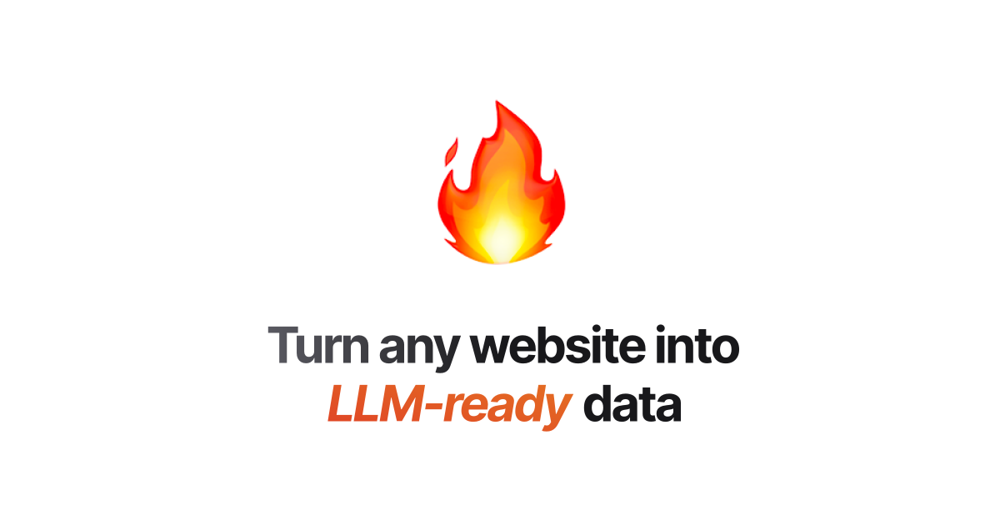

# n8n-nodes-firecrawl

This is an n8n community node. it lets you use Firecrawl in your n8n workflows.

Firecrawl is a web scraping tool that allows you to extract data from websites and APIs.

https://www.firecrawl.dev/

[n8n](https://n8n.io/) is a [fair-code licensed](https://docs.n8n.io/reference/license/) workflow automation platform.

[Installation](#installation)  
[Operations](#operations)  
[Credentials](#credentials)   
[Compatibility](#compatibility)  
[Usage](#usage) 
[Resources](#resources)  

## Installation

Follow the [installation guide](https://docs.n8n.io/integrations/community-nodes/installation/) in the n8n community nodes documentation.

## Operations

### Scrape

Firecrawl converts web pages into markdown, ideal for LLM applications.

- It manages complexities: proxies, caching, rate limits, js-blocked content
- Handles dynamic content: dynamic websites, js-rendered sites, PDFs, images
- Outputs clean markdown, structured data, screenshots or html.

### Crawl

Firecrawl can recursively search through a urls subdomains, and gather the content

- Firecrawl thoroughly crawls websites, ensuring comprehensive data extraction while bypassing any web blocker mechanisms. Here’s how it works:

- URL Analysis: Begins with a specified URL, identifying links by looking at the sitemap and then crawling the website. If no sitemap is found, it will crawl the website following the links.

- Recursive Traversal: Recursively follows each link to uncover all subpages.

- Content Scraping: Gathers content from every visited page while handling any complexities like JavaScript rendering or rate limits.

- Result Compilation: Converts collected data into clean markdown or structured output, perfect for LLM processing or any other task.

This method guarantees an exhaustive crawl and data collection from any starting URL.

### Map

The easiest way to go from a single url to a map of the entire website. This is extremely useful for:

- When you need to prompt the end-user to choose which links to scrape
- Need to quickly know the links on a website
- Need to scrape pages of a website that are related to a specific topic (use the search parameter)
- Only need to scrape specific pages of a website

## Credentials

**FireCrawl API**

The FireCrawl API is the only authentication method available for this node. You can find your API key in the FireCrawl dashboard.

## Compatibility

This node has been tested with the following versions of N8N.

- N8N 1.57.0

## Usage

- Install the Firecrawl node
- Enter your Firecrawl API key
- Choose the operation you want to perform

## Resources

* [n8n community nodes documentation](https://docs.n8n.io/integrations/community-nodes/)
* [Firecrawl API documentation](https://docs.firecrawl.dev/)

